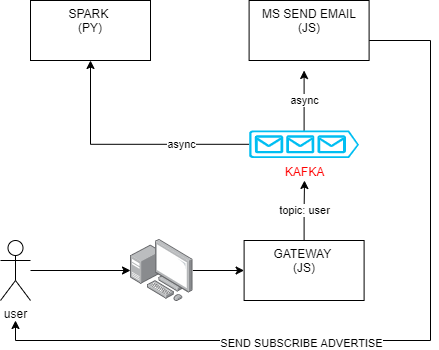
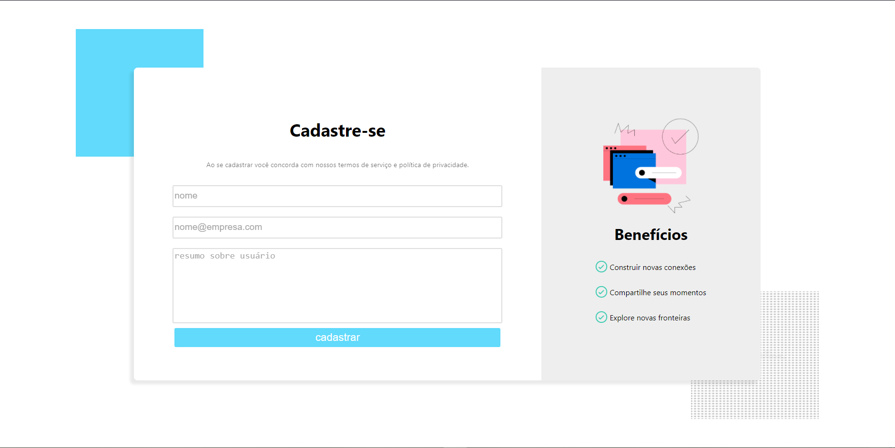

# Kafka-Node Spark Cluster

## Sobre
Projeto final da matéria de Progamação para Sistemas Paralelos e Distribuídos da FGA utilizandos conceitos de Spark Streaming e Apache Kafka

## Arquitetura do projeto


## Front-end da aplicação



## Backend
### Rodando um docker-compose

```
$ docker-compose -f docker-compose.[compose desejado].yml up
```

### Rodando múltiplos composes do spark worker

```
$ docker-compose -f docker-compose.spark_worker.yml up --scale spark-worker=N

# Para saber em que portas os serviços foram abertos
docker-compose ps
```

### Utilizando o Kafka

```
# Para criar novas filas
$ docker exec -it kafka /opt/bitnami/kafka/bin/kafka-topics.sh --create --bootstrap-server 192.168.0.21:9092 \
  --topic NomeTópico --replication-factor 1 --partitions 1

# Para se inscrever em uma fila como produtor
$ docker exec -it kafka /opt/bitnami/kafka/bin/kafka-console-producer.sh --topic testcluster \
  --bootstrap-server 192.168.0.21:9092

# Para se inscrever em uma fila como consumidor
$ docker exec -it kafka /opt/bitnami/kafka/bin/kafka-console-consumer.sh --topic testcluster \
  --from-beginning --bootstrap-server 192.168.0.21:9092
```

### Dando submit em tasks para o cluster Spark

```
$ spark-submit --packages org.apache.spark:spark-sql-kafka-0-10_2.12:3.2.1 contabilizador_kafka.py \
  IntervaloDeJanela 192.168.0.21:9092 NomeFila
```
<!-- spark-submit --packages org.apache.spark:spark-streaming-kafka-0-10_2.13:3.2.1 contabilizador_kafka.py 192.168.0.21:9092 teste_cluster -->

## Frontend
### Intalando Bibliotecas

```
$ npm install
```

### Rodando os Microserviços
```
$ npm run start:gateway
$ npm run start:email
```

## Relatório
### Instalando Dependências
```
$ pip install -r requirements.txt
```

### Rodando o relatório
```
$ python gerador_relatorio.py
```
